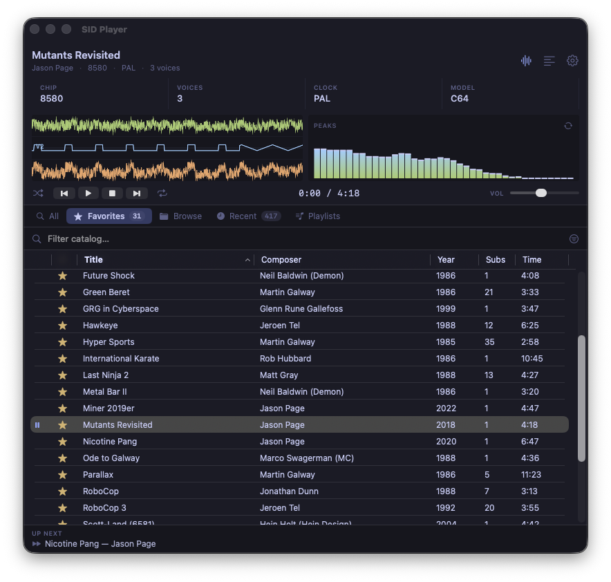

# SID Player

A native macOS player for the [High Voltage SID Collection](https://hvsc.c64.org/) — Commodore 64 music for the masses.

Built on [libsidplayfp](https://github.com/libsidplayfp/libsidplayfp) for cycle-accurate emulation, with a SwiftUI front-end that browses the entire ~60,000-tune HVSC catalog, plays per-voice oscilloscope traces in lockstep with the audio, and reads HVSC's STIL annotations as a scrolling C64-style marquee.

> **Status:** working, polished, signed & notarized — still pre-1.0. Built for personal use; happy to take pull requests.
>
> 



**Download:** grab the latest signed & notarized build from the [Releases page](https://github.com/xrayzsoftware/sidplayer/releases/latest) — Apple Silicon (M1+), macOS 14+.

---

## Features

- **One-click HVSC bootstrap.** Discovers the latest release via `hvsc.c64.org/api/v1/version/7z`, downloads the ~640 MB archive, extracts via the system `tar` (libarchive handles 7z natively on macOS), parses every `.sid` header into a SQLite catalog, and matches each tune to its HVSC `Songlengths.md5` entry.
- **Five-tab catalog browser**: All (~60k tunes with FTS5 full-text search), Favorites (★ persisted), Browse (HVSC directory tree with breadcrumb), Recent (play history), and Playlists.
- **Search filters** — narrow results by SID model (6581/8580), clock speed (PAL/NTSC), and year range, combined with text search.
- **Shuffle & repeat** — shuffle mode picks random tracks from the current list; repeat modes: off, all, one.
- **Sortable, themed track list** with title, composer, year, subtune count, and duration columns.
- **Per-voice oscilloscope** — three additional libsidplayfp instances run in lockstep with the main engine, each with two voices muted, feeding three colored waveform traces. Audio path is independent so a viz-engine failure can't break sound.
- **Cyclic secondary visualizer** — toggle between a Winamp-style 40-band peak meter, a scrolling FFT waterfall, and a phosphor-persistence oscilloscope. All vDSP-backed, log-spaced from 50 Hz to 12 kHz, and themed.
- **STIL scroller** — HVSC's annotations (sample sources, composer notes, "reused in Wizball" trivia) scroll right-to-left in your theme's accent color, locked to the display refresh.
- **Subtune navigation** — smart prev/next: cycles within a multi-subtune tune, jumps between tracks for single-subtune tunes. Auto-advances at song-length end.
- **8 VSCode-inspired themes** — System Default, Nord, Tokyo Night, Dracula, Gruvbox Dark, Catppuccin Mocha, Solarized Dark, Monokai. Theme tokens reach the title bar, visualizers, peak gradient, voice colors, scroller text, and chrome.

---

## Requirements

- **macOS 14 (Sonoma)** or later
- **Xcode 15+** on Apple Silicon (arm64). x86_64 is supported by the codebase but the vendored libsidplayfp archive is arm64-only — see "Universal binary" below to add x86_64.
- **xcodegen** to regenerate the Xcode project from `project.yml`
- ~1 GB disk space for HVSC

`libsidplayfp` is bundled as a static archive under `Sources/CSIDEngine/Vendor/`; you do **not** need `brew install libsidplayfp`.

---

## Building from source

```bash
brew install xcodegen
git clone https://github.com/xrayzsoftware/sidplayer.git
cd sidplayer
xcodegen generate
xcodebuild -project SIDPlayer.xcodeproj -scheme SIDPlayer -configuration Debug build
open ~/Library/Developer/Xcode/DerivedData/SIDPlayer-*/Build/Products/Debug/SID\ Player.app
```

Or open `SIDPlayer.xcodeproj` in Xcode after running `xcodegen generate`, hit ⌘R.

For a clean Release install to `/Applications`:

```bash
./scripts/install.sh
```

### Universal binary

The vendored `libsidplayfp.a` is arm64 only. To produce a universal build, build libsidplayfp for x86_64 separately and `lipo` the archives together:

```bash
arch -x86_64 /usr/local/bin/brew install libsidplayfp
lipo -create \
    Sources/CSIDEngine/Vendor/lib/libsidplayfp.a \
    /usr/local/opt/libsidplayfp/lib/libsidplayfp.a \
    -output Sources/CSIDEngine/Vendor/lib/libsidplayfp.a
```

### CLI tools

The repo also produces three CLI binaries via SwiftPM:

```bash
swift build
swift run sidspike Tests/Fixtures/Commando.sid 10        # play a .sid for 10s
swift run sidcat download                                # bootstrap HVSC
swift run sidcat index                                   # rebuild the catalog
swift run sidcat search "rob hubbard"                    # FTS5 search
swift run sidcat info <id>                               # full metadata
swift run sidcat play <id> 30                            # play by catalog ID
```

The CLIs share the same engine and catalog as the GUI app — useful for headless testing.

### Tests

```bash
swift test
```

21 tests covering PSID/RSID header parsing (incl. v2+ flag bits → clock/model), HVSC `Songlengths.md5` parser (including CRLF + `[Database]` header regression cases), and end-to-end indexer behavior against a synthetic HVSC tree.

---

## Architecture

```
sidplayer/
├── App/                              SwiftUI app (Xcode target)
│   ├── SIDPlayerApp.swift            @main + window tinting
│   ├── AppState.swift                @Observable state, persistence
│   ├── ContentView.swift             top-level layout
│   ├── Theme.swift                   AppTheme + 8 presets
│   ├── TuneItem.swift                view-model wrapper for TuneRow
│   ├── AppIcon.icns                  10-size icon, hand-built via iconutil
│   └── Views/                        all subviews
│       └── Visualizers/              waveform + peak meter
│
├── Sources/
│   ├── CSIDEngine/                   Obj-C++ bridge over libsidplayfp
│   │   ├── include/CSIDEngine.h      pure Obj-C public API for Swift
│   │   ├── CSIDEngine.mm             Obj-C++ wrapping sidplayfp + SidTune
│   │   └── Vendor/                   bundled libsidplayfp static archive
│   │       ├── lib/libsidplayfp.a    arm64 static lib (~470 KB)
│   │       ├── include/sidplayfp/    libsidplayfp's public headers
│   │       └── LICENSE.libsidplayfp  GPL-2.0 license text
│   │
│   ├── SIDEngine/                    Pure-Swift player core
│   │   ├── SIDEngine.swift           Swift wrapper over the bridge
│   │   ├── SIDPlayer.swift           AVAudioEngine + producer thread
│   │   ├── PSIDHeader.swift          PSID/RSID v1-v4 parser (no libsidplayfp)
│   │   ├── Songlengths.swift         HVSC Songlengths.md5 parser
│   │   ├── RingBuffer.swift          SPSC Int16 audio FIFO
│   │   └── VizTap.swift              latest-N-samples non-FIFO buffer
│   │
│   ├── SIDCatalog/                   Catalog + indexing (depends on GRDB)
│   │   ├── CatalogDB.swift           Schema, migrations, FTS5
│   │   ├── HVSCSource.swift          Validated HVSC root
│   │   ├── HVSCDownloader.swift      URLSession + tar extraction
│   │   ├── HVSCIndexer.swift         Walk → parse → md5 → insert
│   │   └── STIL.swift                HVSC STIL.txt parser
│   │
│   ├── sidspike/                     CLI: play a single .sid
│   └── sidcat/                       CLI: catalog management
│
└── Tests/                            XCTest suites
    ├── SIDEngineTests/               PSID + Songlengths parsers
    └── SIDCatalogTests/              CatalogDB + Indexer end-to-end
```

### Audio path

```
                            ┌────────────────────────────────────────────┐
                            │  AVAudioEngine source node (audio thread)  │
                            │  ────────────────────────────────────────  │
                            │  drains main RingBuffer  → Float32 output  │
                            │  also writes to main VizTap (peak meter)   │
                            └─────────────────▲──────────────────────────┘
                                              │ pulls 1024 samples/call
                                              │
┌───────────────────────────────────┐         │
│  Producer thread (.userInitiated) │ ────────┘
│  ─────────────────────────────    │
│  loop:                            │
│    main engine.render()  → ring   │   ┌────────────────────┐
│    voice0 engine.render() ─┐      │   │  Voice VizTaps × 3 │
│    voice1 engine.render() ─┼──────┼──▶│  (peek-the-latest) │
│    voice2 engine.render() ─┘      │   └─────────▲──────────┘
└───────────────────────────────────┘             │
                                                  │ snapshotFloats(1024) every frame
                                        ┌─────────┴──────────┐
                                        │  WaveformView      │
                                        │  (3 stacked panels)│
                                        └────────────────────┘
```

- Main libsidplayfp engine drives the audible mix
- Three additional engines run the same tune with two voices muted each, in lockstep, feeding the per-voice waveform display
- Ring buffer is 4 096 samples (~93 ms at 44.1 kHz) — small enough that visual lag is imperceptible, large enough that the producer thread can keep up
- Voice engine failures cannot block the main audio path: render results that come back zero are silently dropped

### Why an Obj-C++ bridge?

libsidplayfp is C++. Swift can't import C++ directly with full fidelity (no class-method support across language barriers in stable Swift). Wrapping it in an Obj-C++ `.mm` file with a pure-Obj-C `.h` interface lets Swift use it as a normal `NSObject`. The bridge stays small (~150 LoC) and only exposes what the Swift layer actually needs.

---

## Known limitations

- **Distribution license:** libsidplayfp is GPLv2 and is statically linked into the app. Any distributed binary is therefore GPL. Fine for a personal build; matters if you ever want to ship commercially. The bundled license sits at `Sources/CSIDEngine/Vendor/LICENSE.libsidplayfp`.
- **arm64 only by default.** The vendored libsidplayfp archive is arm64; producing a universal app requires lipo'ing in an x86_64 build (see Universal binary section above).
- **Title-bar text contrast** on lighter themes (Solarized Light, etc.) can be off — macOS computes the title color from the window appearance rather than your theme palette.

---

## Acknowledgements

- **High Voltage SID Collection** team — the canonical archive of C64 music ([hvsc.c64.org](https://hvsc.c64.org)).
- **libsidplayfp** authors (Leandro Nini, Antti Lankila, Simon White) — the engine that does all the actual emulation.
- **GRDB.swift** by Gwendal Roué — the SQLite wrapper used for the catalog.
- The original C64 composers — Rob Hubbard, Martin Galway, Jeroen Tel, Jonathan Dunn, Jason Page, Chris Hülsbeck, and the rest of the SID pantheon. This player exists because their music does.

---

## License

Source code in this repository: MIT — see [`LICENSE`](LICENSE).

`libsidplayfp` **3.0.0** (statically linked in) is GPLv2-or-later — see `Sources/CSIDEngine/Vendor/LICENSE.libsidplayfp`, with the pinned version and corresponding-source pointer in `Sources/CSIDEngine/Vendor/VERSION`. Distributing the built `.app` therefore requires GPL compliance: the binary as a whole becomes GPL, and you must offer the corresponding source (libsidplayfp's source at that version, plus this repo).
